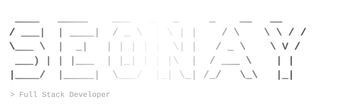

<!-- ═══════════════════════════════════════════════════════════════════════ -->
<!--                            HERO BANNER                                   -->
<!-- ═══════════════════════════════════════════════════════════════════════ -->

<div align="center">
  
</div>

<!-- Animated ASCII logo (SMIL SVG) -->
<div align="center">
  
</div>

<br/>

<!-- Typing effect -->
<div align="center">
  <a href="https://www.matheodelaunay.studio/">
    
  </a>
</div>

<br/>

<!-- Social links -->
<div align="center">
  <a href="mailto:matheodelaunay04@gmail.com"></a>
  <a href="https://www.linkedin.com/in/matheo-delaunay/"></a>
  <a href="https://www.matheodelaunay.studio/"></a>
  
</div>

<br/>

<!-- ═══════════════════════════════════════════════════════════════════════ -->
<!--                             ABOUT                                        -->
<!-- ═══════════════════════════════════════════════════════════════════════ -->

## &nbsp;`>`&nbsp; whoami

```ts
const seonay: Developer = {
  name: "Mathéo 'Seonay' Delaunay",
  role: "Full Stack Developer",
  location: "Nantes, France 🇫🇷",
  focus: ["Clean architecture", "Impactful UX", "Performance"],
  currently: "Cooking secret side projects 🚧",
  openTo: ["Freelance", "Full-time", "Long-term"],
};
```

<br/>

<!-- ═══════════════════════════════════════════════════════════════════════ -->
<!--                            TECH STACK                                    -->
<!-- ═══════════════════════════════════════════════════════════════════════ -->

## &nbsp;`>`&nbsp; tech stack

<div align="center">


</div>

<br/>

<!-- ═══════════════════════════════════════════════════════════════════════ -->
<!--                          FEATURED PROJECTS                               -->
<!-- ═══════════════════════════════════════════════════════════════════════ -->

## &nbsp;`>`&nbsp; featured projects

<table>
  <tr>
    <td width="33%" valign="top">
      <h3>🌐 Portfolio</h3>
      <p>Personal portfolio showcasing projects, design concepts and experiments.</p>
      <p>
        
        
        
      </p>
      <a href="https://www.matheodelaunay.studio/">→ Live site</a>
    </td>
    <td width="33%" valign="top">
      <h3>⚡ CoreHub</h3>
      <p>All-in-one hub to centralize everything : habits, sport, expenses, freelance, reading & more.</p>
      <p>
        
        
        
      </p>
      <a href="#">→ Coming soon</a>
    </td>
    <td width="33%" valign="top">
      <h3>🔒 Secret Projects</h3>
      <p>Classified. Stay tuned for upcoming releases.</p>
      <p>
        
        
      </p>
      <sub>Coming soon…</sub>
    </td>
  </tr>
</table>

<br/>

<!-- ═══════════════════════════════════════════════════════════════════════ -->
<!--                            STATISTICS                                    -->
<!-- ═══════════════════════════════════════════════════════════════════════ -->

## &nbsp;`>`&nbsp; statistics

<div align="center">
  
  
</div>

<div align="center">
  
</div>

<div align="center">
  
</div>

<br/>

<!-- Trophies -->
<div align="center">
  
</div>

<br/>

<!-- ═══════════════════════════════════════════════════════════════════════ -->
<!--                              FOOTER                                      -->
<!-- ═══════════════════════════════════════════════════════════════════════ -->

<div align="center">
  
  <p><sub>💙 Crafted with precision, caffeine & clean commits 💙</sub></p>
</div>
